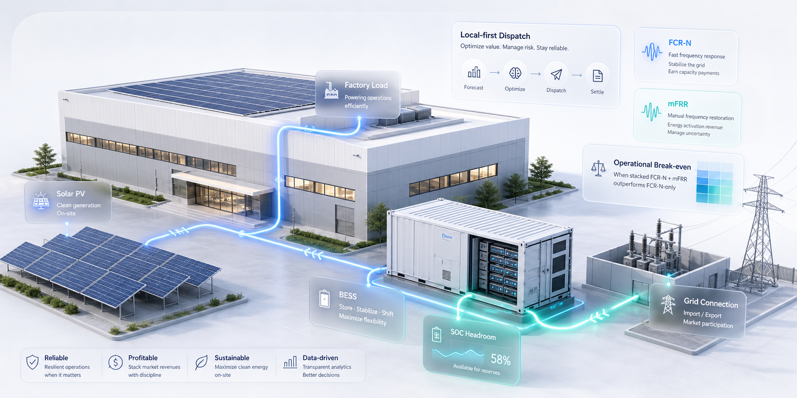

# Behind-the-Meter BESS Market Optimizer




Scenario-based optimizer for deciding how a 1 MW / 2 MWh behind-the-meter battery should allocate hourly capacity between local customer savings, FCR-N, and mFRR.

Built around an explainable representative-day schedule, the model keeps the dispatch logic visible: what is held back for the customer, what is available for reserve markets, and which constraints limit market participation.

## Market Context

Industrial sites with solar PV and batteries sit between site operations and ancillary-service markets. The same battery capacity cannot be used twice: energy reserved for market commitments may be unavailable for factory peaks, and mFRR activation can change the state-of-charge path for the rest of the day.

Stacking has to be scheduled against site operations. Each hour balances load, PV generation, battery state of charge, grid prices, reserve prices, activation assumptions, and local operating constraints before capacity can be offered to any market use case.

FCR-N is the reserve-market benchmark because it is capacity-led and comparatively predictable in this representative-day model. mFRR is treated as a conditional stacking opportunity because it can add capacity and activation upside while also changing the battery's later operating position.

## System Setup

The model represents one commercial and industrial site with:

- A 1 MW / 2 MWh behind-the-meter battery
- Co-located solar PV
- Factory load
- Grid import/export connection
- FCR-N and mFRR market signals
- Local peak-shaving and state-of-charge constraints

The cover image summarizes this setup: PV and factory load are served locally first, the battery preserves headroom for customer value and reserve readiness, and only remaining feasible capacity is considered for FCR-N and mFRR.

## Main Finding

The main result is conditional: stacked FCR-N + mFRR is only better when mFRR compensation is strong enough to cover activation risk and the local flexibility it consumes.

- FCR-N-only is the stable benchmark because it adds capacity revenue while preserving local dispatch.
- Stacked FCR-N + mFRR outperforms FCR-N-only in the low-activation case.
- In base and high mFRR activation cases, expected activation consumes SOC and can reduce later local savings, making stacked participation lower value than FCR-N-only.

> Use mFRR only when the battery has enough operational margin for activation risk; otherwise, FCR-N-only is the cleaner choice.

A production version would add a forecasting layer trained on at least two years of site, market, weather, and activation data, but the constrained optimizer would still enforce SOC, local savings, reserve readiness, and shared-capacity limits.

## Setup

From the repository root, install the workspace dependencies:

```powershell
uv sync --all-packages
```

## Running the pipeline

Rebuild all data and model outputs with the single pipeline runner:

```powershell
uv run --package bess-optimizer bess-run-pipeline
```

The runner executes the following stages in order and stops immediately if a
stage fails:

1. Rebuild the processed representative-day dataset.
2. Run the Part A core model.
3. Run the B3 break-even sensitivity.

To run an individual stage instead, use the corresponding command below.

Build the processed representative-day dataset:

```powershell
uv run --package bess-optimizer bess-build-data
```

Run the core model:

```powershell
uv run --package bess-optimizer bess-run-model
```

Run the B3 break-even sensitivity:

```powershell
uv run --package bess-optimizer bess-run-sensitivity
```

Then start the Streamlit dashboard:

```powershell
uv run --package bess-dashboard bess-dashboard
```

The model writes:

- `data/output/part_a_dispatch_hourly_se3_20260624.csv`
- `data/output/part_a_scenario_summary_se3_20260624.csv`
- `data/output/part_a_constraint_audit_se3_20260624.csv`
- `data/output/b3_mfrr_break_even_sensitivity_se3_20260624.csv`

## Fastest way to view the dashboard

The published GHCR image starts the dashboard with the committed data and model
outputs. It does **not** rebuild the pipeline.

```powershell
docker run --rm -p 8501:10000 ghcr.io/kayvanshah1/btm-bess-market-optimizer:latest
```

Open [http://localhost:8501](http://localhost:8501).

## Project Documents

- [Executive summary](EXECUTIVE_SUMMARY.md)
- [Technical write-up](docs/TECHNICAL_WRITEUP.md)
- [Assumptions and formulas](docs/ASSUMPTIONS_AND_FORMULAS.md)
- [B3 break-even analysis](docs/B3_BREAK_EVEN_ANALYSIS.md)
- [Data method](docs/DATA_METHOD.md)
- [Implementation notes](docs/IMPLEMENTATION_NOTES.md)
- [Dashboard notes](apps/dashboard/README.md)

## AI Tools Used

I used OpenAI ChatGPT and Codex as support tools during this project. They were used for the following purposes:

| Purpose | How AI was used |
|---|---|
| Research and terminology | ChatGPT was used to understand market concepts such as FCR-N, mFRR, activation uncertainty, reserve readiness, behind-the-meter battery operation, and local savings constraints. |
| Problem framing | ChatGPT was used to structure the modelling approach, clarify the local-first operating logic, and compare possible ways to represent mFRR activation uncertainty. |
| Implementation support | Codex was used to help write and refactor parts of the Python implementation, including data processing, dispatch logic, scenario runners, metrics, and dashboard components. |
| Debugging and review | ChatGPT and Codex were used to review whether the model outputs were sensible, identify confusing behaviour in the scenario results, and refine the treatment of FCR-N and mFRR trade-offs. |
| Documentation | ChatGPT was used to help draft and organize the README and documentation sections covering methodology, assumptions, scenario interpretation, limitations, and future extensions. |

All modelling assumptions, scenario choices, code changes, result interpretation, and final project materials were reviewed, edited, and accepted by me.

No proprietary customer or company data was provided to AI tools. The project uses public, synthetic, or representative data only.

## Disclaimer

This project is a technical implementation for representative-day behind-the-meter BESS optimization. It is not intended for production battery dispatch, live market bidding, customer billing, or settlement as-is.

A production deployment would require additional engineering and operational controls, including validated customer meter data, real tariff and contract modelling, TSO product-rule validation, bid acceptance and settlement handling, battery warranty and degradation constraints, cyber-security review, secrets management, monitoring, audit logging, human override workflows, and compliance validation.

> [!CAUTION]
> Do not use this project to control live battery assets, submit real market bids, or make customer billing decisions without independent validation and production controls.

## License

This project is licensed under the BSD 3-Clause License. See [LICENSE](LICENSE) for details.
