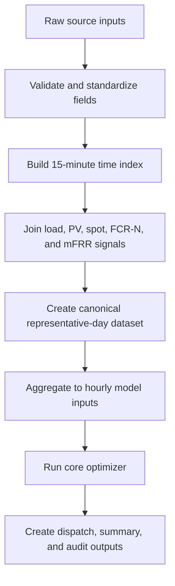
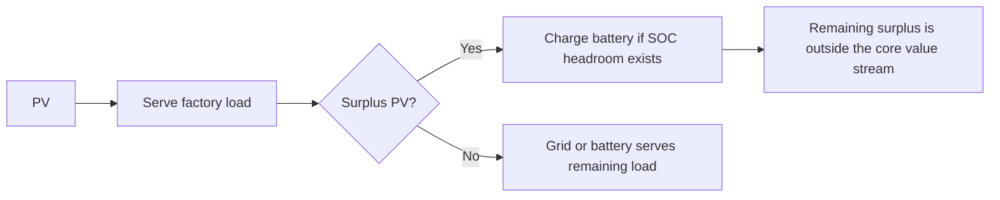

# Data Method

## 1. Purpose

The data layer builds a representative day for testing a behind-the-meter battery at a C&I site. The goal is not to reproduce one customer meter exactly. The goal is to create a realistic enough operating profile to evaluate local savings, FCR-N capacity revenue, and mFRR capacity and activation uncertainty under shared battery constraints.

## 2. Representative Day

| Item | Value |
|---|---|
| Date | 2026-06-24 |
| Spot bidding zone | SE3 |
| mFRR zone approximation | SN3 |
| Canonical processed resolution | 15 minutes |
| Core model resolution | Hourly |
| Site type | Representative Swedish C&I light-factory profile |
| PV capacity scaling | 800 kW |

The hourly model is used because 24 hourly steps keep the representative-day result compact and easy to review. The 15-minute processed file is retained as the cleaner canonical data layer for future extension.

## 3. Data Pipeline



## 4. Data Sourcing and Access

The project does not use proprietary company or customer data, so the dataset is built from public, manually exported, and synthetic representative inputs. The sources are used to create a realistic representative day rather than a settlement-grade market reconstruction.

| Data input | Source / access path | How it is used | Notes |
|---|---|---|---|
| C&I site load | Synthetic representative profile created for this project | Primary behind-the-meter factory demand profile | Not customer-metered data; used to create a realistic C&I operating shape |
| PV production shape | eSett Open Data production profile | Normalized and scaled to an 800 kW site PV profile | Used as a public solar-shape proxy, not as site-metered PV |
| Spot price | Nord Pool day-ahead price reference for SE3, with Svenska Kraftnät spot data as fallback/reference | Customer energy cost, high-price discharge, low-price charging, and mFRR replacement-cost proxy | Nord Pool is the main Nordic day-ahead market reference; SE3 is used as the spot bidding zone |
| FCR-N capacity price | Svenska Kraftnät Mimer market data | FCR-N reserve capacity revenue | Used for the FCR-N benchmark and stacked reserve allocation |
| mFRR capacity price and volume | Svenska Kraftnät Mimer market data | mFRR up-capacity value and feasibility context | Mapped to the SN3 approximation used in this representative case |
| mFRR activation energy price, volume, and flag | Svenska Kraftnät Mimer market data | Expected activation value and low/base/high activation sensitivity | Activation is uncertain, so it is handled as scenario sensitivity rather than assumed perfect foresight |

Nord Pool is used as the day-ahead spot-price reference because it is the main physical power exchange for the Nordic market. Svenska Kraftnät Mimer is used for Swedish reserve-market signals including FCR and mFRR data. eSett Open Data is used as a public production-data source for shaping the PV profile.

The local C&I load profile is synthetic. It is deliberately included to avoid using proprietary customer data while still producing a non-trivial behind-the-meter operating case.

## 5. Raw File Families

| File family | Source type | Model use |
|---|---|---|
| `synthetic_*` | Synthetic representative input | C&I light-factory load profile |
| `esett_*` | Public eSett Open Data extract | Solar production shape used as PV proxy |
| `nordpool_*` | Nord Pool day-ahead price export/reference | SE3 spot-price input |
| `svk_*` | Svenska Kraftnät public data extract | Spot-price reference or fallback |
| `mimer_fcr_*` | Svenska Kraftnät Mimer extract | FCR-N capacity price |
| `mimer_mfrr_capacity_*` | Svenska Kraftnät Mimer extract | mFRR up-capacity price and volume |
| `mimer_mfrr_energy_*` | Svenska Kraftnät Mimer extract | mFRR activation energy price, activation volume, and activation flag |

The raw data manifest at `data/raw/raw_data_manifest.csv` records the source-aware file mapping used by the processing script.

## 6. Site Load

The model uses `light_factory_one_shift_kw` from:

```text
data/raw/synthetic_representative_swedish_ci_load_profiles_hourly.csv
```

This is synthetic representative C&I load, not customer-metered data. It is intended to create a non-trivial behind-the-meter profile with:

- overnight baseload
- morning ramp-up
- working-hour demand
- PV overlap
- peak exposure
- room for battery dispatch decisions

Machine-level scheduling is outside scope because no production tasks, machine constraints, deadlines, or process-flexibility blocks are provided.

## 7. PV

PV is based on a public solar production shape from the eSett production profile, normalized and scaled to 800 kW site PV capacity.

The energy-flow priority is:



PV export optimization is not included as a core value stream. The focus is local self-consumption, grid-import reduction, peak shaving, and reserve-market participation.

## 8. Market Signals

Spot price is used for:

- customer energy cost
- high-price local discharge
- low-price grid charging
- mFRR activation replacement-cost proxy

FCR-N is modelled as capacity revenue. FCR-N commitment requires capacity and SOC headroom, not scheduled physical discharge.

mFRR is modelled with:

- mFRR up capacity price
- mFRR up capacity volume
- activation energy price
- activation volume / flag
- low, base, and high activation sensitivity

## 9. Processed Files

The data build writes:

| File | Rows | Purpose |
|---|---:|---|
| `data/processed/representative_day_15min_se3_20260624.csv` | 96 | Canonical processed representative-day dataset |
| `data/processed/representative_day_hourly_se3_20260624.csv` | 24 | Main core model input |

Rebuild with:

```powershell
uv run --package bess-optimizer bess-build-data
```

## 10. Model Outputs

The core model writes:

| File | Purpose |
|---|---|
| `data/output/part_a_dispatch_hourly_se3_20260624.csv` | Hourly dispatch, SOC, reserve allocation, value components, and flags |
| `data/output/part_a_scenario_summary_se3_20260624.csv` | Scenario-level customer value, market revenue, total value, and deltas |
| `data/output/part_a_constraint_audit_se3_20260624.csv` | Feasibility and constraint audit by scenario |

## 11. Data Limitations

Current limitations are:

- one representative day only
- synthetic representative site load
- hourly core model
- approximate SE3 / SN3 alignment
- no settlement-grade market reconstruction
- no measured customer meter data
- no PV forecast uncertainty
- no multi-day terminal SOC policy

These limitations are acceptable for the current modelling objective because the main task is to reason clearly about FCR-N versus mFRR commitment under local savings, peak protection, SOC, and activation uncertainty.

## 12. Future Data Requirements

The current core model uses one representative day to keep the result transparent and reviewable. A production version should be trained and backtested on a larger historical dataset, ideally at least two years of hourly or 15-minute observations.

At least two years of history would help capture:

- weekday versus weekend operating patterns
- seasonal PV and load variation
- winter versus summer price behaviour
- recurring peak-load windows
- reserve-market price seasonality
- mFRR activation frequency and scarcity periods
- unusual operating days, outages, holidays, and market spikes

| Data family | Minimum useful history | Why it matters |
|---|---:|---|
| Site load | 1-2 years | Learn customer demand seasonality, operating schedules, and peak-risk windows |
| PV generation / forecast | 1-2 years | Learn solar-shape uncertainty and charging opportunity |
| Spot prices | 2+ years | Capture price volatility and arbitrage opportunities |
| FCR-N prices | 2+ years | Estimate reserve revenue stability |
| mFRR capacity prices | 2+ years | Learn when mFRR is attractive relative to FCR-N |
| mFRR activation prices / flags | 2+ years | Estimate activation probability and activation-value risk |
| Weather | 1-2 years | Improve PV and load forecasts |
| Calendar features | 1-2 years | Capture weekday, weekend, holiday, and operating-calendar effects |

Before using this data for ML or optimization, the pipeline should check for missing intervals, duplicate timestamps, daylight-saving-time issues, impossible load/PV values, meter resets, stuck sensor values, and abnormal market records.

Real market spikes and real activation events should usually be retained because they are economically important. Bad meter data, duplicate records, and impossible sensor values should be cleaned, flagged, or excluded.
