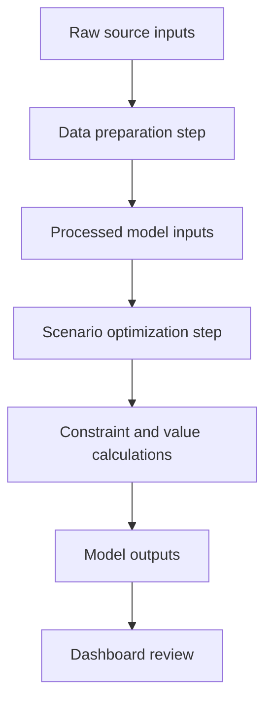
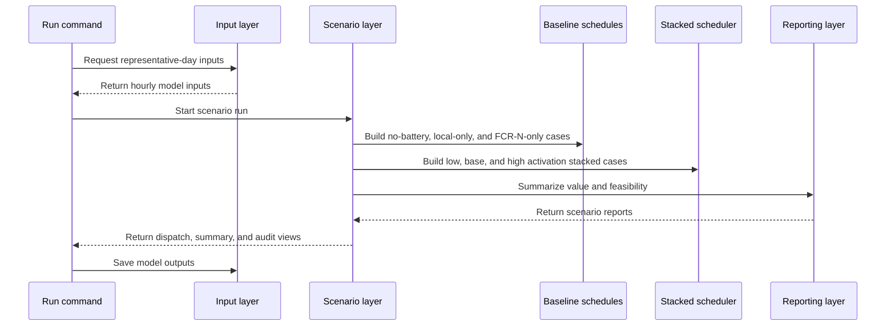

# Implementation Notes

## 1. Repository Structure

The root README intentionally avoids a full project layout. This document records the implementation structure for reviewers who want to inspect the code.



## 2. Optimizer Package

| Module | Responsibility |
|---|---|
| `bess_optimizer.model.config` | Battery, site, reserve, and run configuration |
| `bess_optimizer.model.battery` | SOC state transitions |
| `bess_optimizer.model.energy_flows` | PV, load, grid, and battery flow splitting |
| `bess_optimizer.model.dispatch` | Local dispatch, thresholds, and local reserve logic |
| `bess_optimizer.model.constraints` | Constraint status construction and headroom checks |
| `bess_optimizer.model.baselines` | No-battery, local-only, and FCR-N-only baselines |
| `bess_optimizer.model.scheduler` | Stacked FCR-N/mFRR candidate allocation |
| `bess_optimizer.model.scenarios` | Scenario orchestration |
| `bess_optimizer.model.metrics` | Scenario summary and constraint audit |
| `bess_optimizer.model.rows` | Output row construction and operating metrics |
| `bess_optimizer.model.io` | Input and output file handling |
| `bess_optimizer.model.schemas` | Typed schemas used across the model |

## 3. Runtime Flow



## 4. Candidate Scheduler

The stacked scheduler works hour by hour:

1. Apply local dispatch first.
2. Calculate local reserve for near-term peak exposure.
3. Compute remaining market capacity.
4. Enumerate FCR-N/mFRR capacity splits in 0.25 MW steps.
5. Reject candidates that violate SOC, power, shared capacity, FCR-N headroom, or mFRR readiness.
6. Score feasible candidates by capacity revenue plus expected activation value.
7. Select the best feasible candidate.
8. Apply expected activation SOC drain in base/high activation cases.

This is intentionally solver-free. For the current one-day problem, exhaustive candidate enumeration is easier to review than a MILP while still preventing double-counted capacity.

## 5. Key Configuration

| Setting | Value |
|---|---:|
| Battery power | 1.0 MW |
| Battery energy | 2.0 MWh |
| Initial SOC | 1.0 MWh |
| Minimum SOC | 0.2 MWh |
| Maximum SOC | 1.8 MWh |
| Charge efficiency | 95% |
| Discharge efficiency | 95% |
| Degradation proxy | 3.0 EUR/MWh |
| Minimum savings floor | 5% |
| Market capacity step | 0.25 MW |
| FCR-N response buffer | 0.25 hours |
| mFRR activation duration | 1.0 hour |
| mFRR readiness lookback | 1 hour |

## 6. Dashboard

The dashboard is a Streamlit app with three main views:

| View | Purpose |
|---|---|
| Data | Inspect load, PV, net load, and market signals |
| Dispatch | Compare scenarios, SOC, reserve allocations, value components, and audits |
| Methodology | Explain objective, operating priority, scenarios, constraints, and assumptions |

Run it with:

```powershell
uv run --package bess-dashboard bess-dashboard
```

## 7. Reproducibility Commands

Install all workspace packages:

```powershell
uv sync --all-packages
```

Rebuild processed data:

```powershell
uv run --package bess-optimizer python scripts/build_processed_dataset.py
```

Run the model:

```powershell
uv run --package bess-optimizer python scripts/run_part_a_model.py
```

Run tests:

```powershell
uv run pytest
```

## 8. Intentional Exclusions

The following are not implemented in the current core model:

- FCR-D
- aFRR
- machine-level production scheduling
- PV export optimization
- full stochastic optimization
- multi-day degradation optimization
- production bidding strategy

They are left as future extensions because the current scope is the FCR-N versus mFRR commitment decision under local savings and battery constraints.
