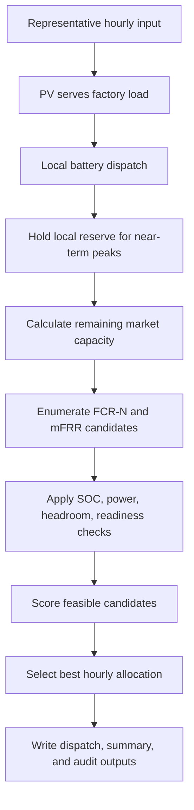
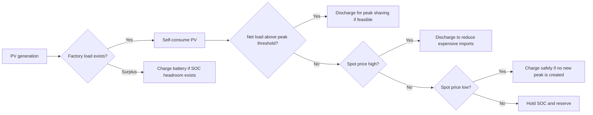
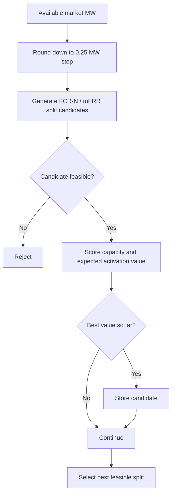
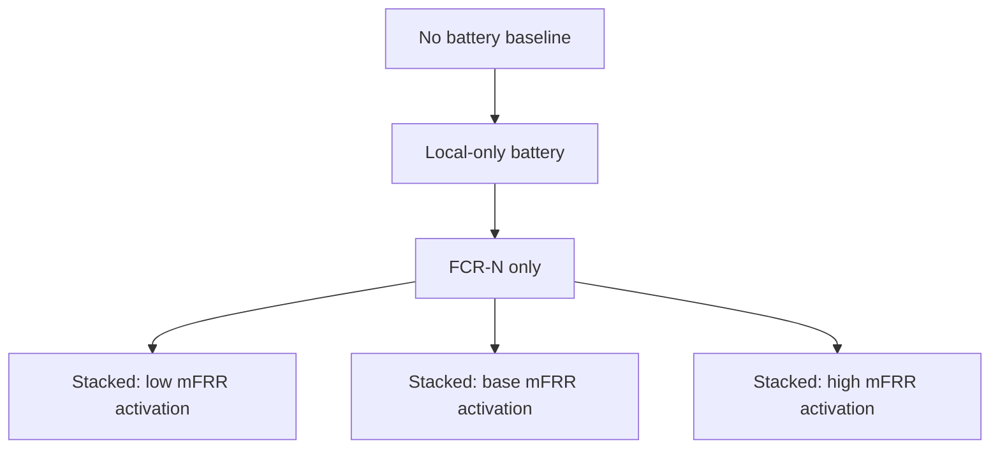
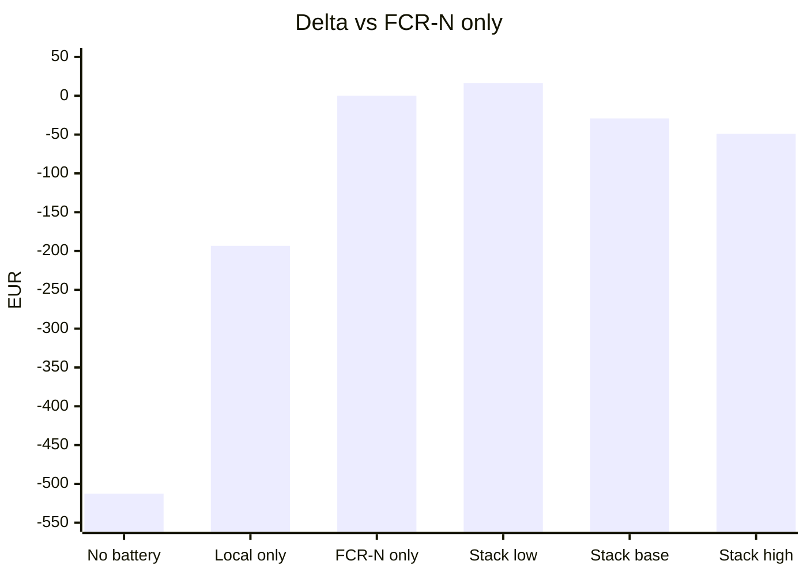

# Technical Write-Up

## 1. Problem Framing

The assignment asks how a single behind-the-meter battery should allocate capacity between local customer value, FCR-N, and mFRR for a representative day.

The difficult part is not simply adding another revenue stream. FCR-N and mFRR compete for the same MW capacity and SOC headroom that local peak shaving and energy-cost savings also need. mFRR activation is uncertain, and if activation consumes battery energy, later customer-side savings can fall.

The model therefore answers:

> When does adding mFRR improve value over FCR-N only, and when does it reduce value by consuming local flexibility?

## 2. Model Scope

This is an intentionally scoped Part A implementation:

| Item | Current scope |
|---|---|
| Asset | One 1 MW / 2 MWh behind-the-meter battery |
| Site | Representative Swedish C&I light-factory profile with PV |
| Market area | SE3 spot / FCR-N, SN3 mFRR signal alignment |
| Resolution | Hourly optimization for Part A |
| Horizon | One representative day, 2026-06-24 |
| Main comparison | FCR-N-only vs stacked FCR-N + mFRR |
| Uncertainty | Low, base, and high mFRR activation assumptions |

The model is not claimed to be a production-grade stochastic optimizer. It is a transparent representative-day scheduler designed to expose the local-savings versus reserve-market trade-off.

## 3. Core Assumptions

The main assumptions used by the model are:

| Area | Assumption |
|---|---|
| Battery | Base asset is one 1 MW / 2 MWh BESS with 1.0 MWh initial SOC, 0.2 MWh minimum SOC, and 1.8 MWh maximum SOC |
| Efficiency | Charge and discharge efficiency are each 95% |
| Site | Representative Swedish C&I light-factory load profile with co-located PV |
| Date and zone | One representative day, 2026-06-24, using SE3 spot/FCR-N and SN3 mFRR alignment |
| Resolution | Hourly dispatch model for the assignment; 15-minute data is retained as source data |
| Local priority | PV self-consumption, local dispatch, and local reserve are handled before market allocation |
| Markets | FCR-N capacity and mFRR up-capacity are modelled; FCR-D and aFRR are excluded |
| mFRR uncertainty | Activation is represented through scenario probabilities and the B3 sensitivity grid |
| B3 battery sweep | Battery count scales aggregate MW, MWh, initial SOC, and SOC limits at the same site; it does not change the customer load profile |
| B3 break-even | B3 tests operational value versus FCR-N-only, not battery investment payback |

The consolidated assumptions and formulas are listed in `docs/ASSUMPTIONS_AND_FORMULAS.md`.

## 4. Decision Structure

For each hour, the model builds the schedule in two layers:

1. Local site dispatch is calculated first.
2. Remaining feasible capacity is allocated to FCR-N and mFRR using candidate capacity splits.



The main hourly decision quantities are:

| Symbol | Meaning |
|---|---|
| `soc_h` | Battery state of charge at hour `h` |
| `local_use_h` | Physical charge or discharge used for local value |
| `local_reserve_h` | Capacity held back for near-term local peak exposure |
| `fcr_h` | FCR-N committed capacity |
| `mfrr_h` | mFRR committed up-capacity |

The current scheduler chooses `fcr_h` and `mfrr_h` after local dispatch, rather than solving all variables simultaneously in a MILP. That choice is deliberate: the problem size is small, the candidate grid is easy to audit, and the assignment rewards clear reasoning more than solver complexity.

## 5. Objective

The scenario-level value is:

```text
Total value =
    local savings versus no-battery baseline
  + FCR-N capacity revenue
  + mFRR capacity revenue
  + expected mFRR activation value
```

For candidate reserve allocation in each hour:

```text
candidate value =
    FCR-N MW * FCR-N price * duration
  + mFRR MW * mFRR capacity price * duration
  + expected mFRR activation value
```

Expected mFRR activation value is calculated from activation price, spot-price replacement cost, discharge efficiency, degradation cost, committed mFRR MW, and activation probability.

## 6. Constraints

The model maps the assignment constraints as follows:

| Assignment rule | Implementation |
|---|---|
| Savings-first floor | Scenario-level local savings must exceed the configured 5% minimum |
| Peak-power protection | Ancillary commitments must not create additional peak exposure when battery discharge capacity remains available |
| Battery physics | SOC, energy capacity, power limit, and efficiency are enforced |
| Shared capacity | Local physical use + local reserve + FCR-N + mFRR cannot exceed 1 MW |
| FCR-N headroom | FCR-N capacity requires symmetric SOC buffer |
| mFRR readiness | mFRR up commitment requires enough current and previous-hour SOC to support activation |
| Local priority | Local dispatch and local reserve are computed before market allocation |

The key shared-capacity constraint is:

```text
max(charge_mw, discharge_mw)
+ local_reserve_mw
+ fcr_commit_mw
+ mfrr_commit_mw
<= battery_power_mw
```

Residual peak exposure is reported separately. It is not hidden or treated as a zero target. The model enforces that ancillary-service commitments do not create additional peak exposure where the battery still has available discharge capacity. A 1 MW / 2 MWh battery may still be physically unable to eliminate all baseline peak exposure after SOC, reserve, and power constraints are respected.

## 7. Local Dispatch

Local operation follows a savings-first hierarchy:



This creates the physical battery path. Market participation is then layered only on remaining feasible capacity.

## 8. FCR-N and mFRR Allocation

After local dispatch, available market capacity is calculated as:

```text
available market capacity =
    battery power
  - local physical use
  - local reserve
```

The scheduler enumerates FCR-N and mFRR capacity splits in 0.25 MW steps. Each candidate is checked before it can be selected.



## 9. mFRR Activation Uncertainty

mFRR activation is represented through three scenarios:

| Scenario | Activation assumption | Purpose |
|---|---:|---|
| Stacked low activation | 0.0 | Best-case stacked sensitivity |
| Stacked base activation | Mean activation probability from the processed day | Representative sensitivity |
| Stacked high activation | Twice base activation, capped at 0.75 | Stress sensitivity |

The conservative modelling assumption is that expected mFRR activation has two effects:

1. It can earn expected activation value.
2. It can reduce SOC in base and high activation cases.

That second effect is important. It allows mFRR to reduce later local savings if battery energy is consumed before a peak-shaving or high-price-discharge opportunity.

This is not a full physical replay of every activation event. It is a representative-day sensitivity that makes activation risk visible.

## 10. Scenarios

The model compares six cases:



| Scenario | Role |
|---|---|
| No battery | Reference customer-cost baseline |
| Local-only battery | Local savings benchmark |
| FCR-N only | Main ancillary-service benchmark |
| Stacked low activation | Stacked case with no expected activation drain |
| Stacked base activation | Stacked case with representative activation exposure |
| Stacked high activation | Stacked stress case |

## 11. Results

| Scenario | Total value EUR | Local savings EUR | Local savings % | Delta vs FCR-N only EUR | Minimum SOC MWh | Violations |
|---|---:|---:|---:|---:|---:|---:|
| No battery | 0.00 | 0.00 | 0.0% | -512.46 | 1.00 | 0 |
| Local-only battery | 319.15 | 319.15 | 15.5% | -193.31 | 0.20 | 0 |
| FCR-N only | 512.46 | 319.15 | 15.5% | 0.00 | 0.20 | 0 |
| Stacked: low mFRR activation | 528.83 | 319.15 | 15.5% | 16.38 | 0.20 | 0 |
| Stacked: base mFRR activation | 483.29 | 277.00 | 13.5% | -29.16 | 0.20 | 0 |
| Stacked: high mFRR activation | 463.43 | 249.19 | 12.1% | -49.03 | 0.20 | 0 |



## 12. Interpretation

The local-only battery creates customer-side savings of 319.15 EUR, or 15.5% versus the no-battery baseline. This establishes that the battery has a real local value case before ancillary services are added.

The FCR-N-only case keeps the same local savings and adds 193.31 EUR of FCR-N capacity revenue. This makes it the main benchmark.

The stacked low-activation case improves total value by 16.38 EUR versus FCR-N-only because mFRR capacity can be added without expected SOC depletion.

The base and high activation cases underperform FCR-N-only by 29.16 EUR and 49.03 EUR. In these cases, expected mFRR activation consumes SOC, reducing later local savings. The result is economically useful: mFRR participation should be conditional on activation exposure and opportunity cost, not simply enabled whenever prequalification exists.

## 13. B3 Operational Break-Even Extension

B3 extends Part A from "what happened on this representative day?" to:

> Under what activation and price assumptions would mFRR remain worthwhile?

The B3 analysis uses an operational break-even rule, not full battery CAPEX payback:

> mFRR is worthwhile when the stacked FCR-N + mFRR case creates more total daily value than the FCR-N-only case.

The B3 grid varies mFRR activation probability from 0% to 75%, mFRR capacity price from 0.50x to 2.00x, and aggregate battery count from one to three identical 1 MW / 2 MWh units. It writes `data/output/b3_mfrr_break_even_sensitivity_se3_20260624.csv`.

The expanded grid has 336 cells. Twenty-two cells beat the same-size FCR-N-only benchmark. At the current 1.00x mFRR capacity price, only 0% activation is positive. At 5% activation, only the 1-battery case with a 2.00x capacity-price multiplier becomes positive. Above 5% activation, no tested cell beats FCR-N-only.

| Battery count | Aggregate size | Best delta vs FCR-N-only |
|---:|---:|---:|
| 1 | 1 MW / 2 MWh | +34.77 EUR/day |
| 2 | 2 MW / 4 MWh | +5.91 EUR/day |
| 3 | 3 MW / 6 MWh | +4.88 EUR/day |

The battery-size sweep is useful because SOC headroom matters. It also shows that larger batteries do not automatically make mFRR more attractive: the FCR-N-only benchmark also improves as battery size increases.

The full B3 note is in `docs/B3_BREAK_EVEN_ANALYSIS.md`.

## 14. Constraint Audit

All six scenarios have 24 feasible rows and zero reported violations.

The maximum total reserved or used capacity is 1.0 MW for active battery scenarios, which confirms that local use, local reserve, FCR-N, and mFRR are not double-counted.

Residual peak exposure remains in the results because the battery is capacity and energy constrained. This is expected and documented. The model's protection rule is that market commitments should not create extra peak exposure when battery discharge capacity remains available.

## 15. Why Not a Full MILP

A MILP would be a natural production extension. It would be especially useful for multi-day, 15-minute, multi-market optimization with terminal SOC constraints and forecast uncertainty.

For this assessment, the candidate scheduler is preferable because it is:

- transparent
- small enough to audit manually
- easy to connect to the dashboard
- sufficient for the representative-day FCR-N versus mFRR comparison
- explicit about assumptions and trade-offs

## 16. What I Would Do With More Time: Production Modelling Roadmap

The current model uses a transparent representative-day scheduler. That is appropriate for Part A, but a production version should add a forecasting layer and backtest the optimizer over a much longer history.

The production system should use at least two years of hourly or 15-minute site, market, weather, and activation data. This is needed because battery value depends on repeated temporal patterns: customer operating schedules, seasonal PV output, spot-price volatility, reserve-price regimes, and mFRR activation frequency.

The ML layer should not replace the optimizer. It should provide forecasts and scenario inputs into the constrained dispatch model.

> Historical data -> data quality and anomaly checks -> forecasting / ML models -> load, PV, price, and activation scenarios -> constrained battery optimizer -> dispatch and bidding decision

### Where ML would help

| Problem                         | Recommended method                                                                  | When to use                                                                               |
| ------------------------------- | ----------------------------------------------------------------------------------- | ----------------------------------------------------------------------------------------- |
| Site load forecasting           | Time-series regression, gradient boosting, random forest, or temporal neural models | Use when measured C&I load history is available and peak prediction affects local savings |
| PV forecasting                  | Weather-aware regression or time-series models                                      | Use when PV uncertainty affects battery charging and SOC planning                         |
| Spot-price forecasting          | Regression, gradient boosting, or probabilistic forecasting                         | Use when arbitrage and high-price discharge are material value drivers                    |
| FCR-N price forecasting         | Regression or quantile forecasting                                                  | Use to estimate expected reserve value before committing capacity                         |
| mFRR capacity-price forecasting | Regression or probabilistic forecasting                                             | Use when choosing between FCR-N and mFRR capacity commitments                             |
| mFRR activation probability     | Classification or calibrated probability model                                      | Use when activation uncertainty materially affects SOC and local savings                  |
| mFRR activation price / volume  | Regression or quantile model                                                        | Use to estimate expected activation value and downside risk                               |
| Anomaly detection               | Rule-based checks, robust statistics, isolation forest, or autoencoder-style models | Use before training and optimization to identify corrupted meter or market data           |

### Regression use cases

Regression models are useful when the target is a continuous value.

Examples:

* next-hour site load in kW
* PV generation in kW
* spot price in EUR/MWh
* FCR-N price in EUR/MW/h
* mFRR capacity price in EUR/MW/h
* expected mFRR activation price in EUR/MWh
* expected peak import without dispatch

For an initial production version, gradient boosting or random forest regression would be practical because these models handle non-linear effects, lag features, calendar features, and weather inputs without requiring a large deep-learning setup.

### Classification use cases

Classification models are useful when the target is an event probability.

Examples:

* probability that mFRR is activated in a given hour
* probability that the site exceeds a peak threshold
* probability that PV generation is materially below forecast
* probability of a market-price spike

For mFRR activation, the useful output is not a hard yes/no prediction. The optimizer needs a calibrated probability that can be used in expected-value and risk calculations.

### Anomaly handling

Anomaly detection should run before forecasting and optimization.

Examples of bad data include:

* duplicate timestamps
* missing 15-minute intervals
* impossible negative load
* impossible PV output
* meter resets
* flatlined sensor values
* parsing errors in price data
* inconsistent zone mapping

Not all anomalies should be removed. Real price spikes and real mFRR activations are economically important and should usually be retained. The data layer should distinguish corrupted records from rare but valid market events.

### Evaluation

Forecast accuracy alone is not enough. The production metric should be dispatch value.

The forecasting layer should be evaluated through backtests that measure:

* local customer savings
* peak exposure
* FCR-N revenue
* mFRR capacity and activation value
* SOC feasibility
* reserve-readiness violations
* downside risk under activation uncertainty

The next modelling step is therefore a multi-day or multi-season backtest where forecasts feed the optimizer and the resulting dispatch is compared against FCR-N-only, local-only, and stacked strategies.

## 17. Conclusion

The Part A result is not "mFRR always wins." The result is:

- FCR-N-only is a stable benchmark.
- mFRR helps when activation exposure is low or well compensated.
- mFRR hurts when activation consumes SOC needed for local customer value.
