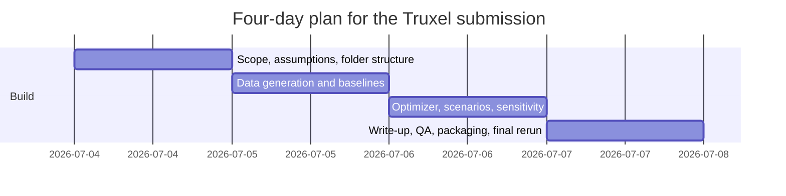

# Public Datasets and Four-Day Submission Plan

## Executive summary

The uploaded Truxel exercise is not a generic machine-learning take-home. It is a scoped optimization problem: for a representative day, allocate a single 1 MW / 2 MWh battery among local savings, FCR-N, and mFRR while respecting a savings-first floor of at least 5%, peak-power protection, state-of-charge and power limits, and an mFRR readiness window, then compare the result to an FCR-only baseline. The brief explicitly says synthetic or public data are acceptable, Python is preferred, and reasoning plus communication matter more than over-engineering.

Given those constraints, the highest-probability four-day submission is **not** a broad forecasting system or an RL prototype. The best primary option is a **small expected-value or scenario-based optimizer** with clear assumptions, a realistic synthetic site load/PV profile, optional public day-ahead price context, a transparent treatment of mFRR activation uncertainty, and a strong executive summary. That aligns directly with the brief’s evaluation priorities: problem framing, quantitative reasoning, and communication.

For general future data-science exercises, the strongest public datasets over a four-day window are those with clear targets, moderate size, permissive licenses, and low setup friction. The most reliable high-signal options are UCI Adult for tabular classification, UCI Bike Sharing for regression, UCI SMS Spam for text classification, MovieLens 100K for recommendation, and UCI ElectricityLoadDiagrams20112014 for time series; additional useful backups are UCI Online Retail II and Hugging Face AG News, though AG News has less-clear licensing.

For this specific submission, I recommend a **twelve-hour plan across four days**: scope and assumptions on day one, baseline plus optimizer on day two, sensitivity analysis and figures on day three, then packaging, reproducibility, and executive summary on day four. The final repository should contain one clean notebook, one script entry point, a README with AI-tool disclosure, a small reproducible data folder, figures, and a zipped submission. That is feasible within the brief’s suggested 8–12 hours while still looking rigorous.

## What the exercise actually demands

The assignment’s core task is narrow and well-specified once stripped of domain wording. For one representative day at hourly or quarter-hour resolution, you must decide how much battery capacity to allocate to **local savings**, **FCR-N**, and **mFRR**, with the hard constraints that local savings come first, guaranteed savings cannot drop below 5%, ancillary commitments must not push grid import above the peak-shaving threshold, SOC and power limits must hold, FCR-D pairing rules matter if you extend the scope, and mFRR requires roughly one hour of readiness before an offered hour. The brief also asks for an explicit treatment of mFRR activation uncertainty and a baseline comparison against an FCR-only schedule.

Two scoping implications follow from that. First, the assignment is closer to **operations research plus scenario analysis** than to pure predictive modeling. Second, the brief strongly favors **clear assumptions over hidden complexity**: it says a clear notebook with honest assumptions scores better than an over-engineered black box, and that any reasonable method is acceptable if the reasoning is sound.

That means your submission should optimize for five things:

| What to optimize for | Why it matters in this brief |
|---|---|
| Clear decision variables and constraints | Problem framing is explicitly graded heavily. |
| Explicit uncertainty treatment for mFRR | This is the “defining difficulty” named in the brief. |
| A strong FCR-only baseline | Required in Part A. |
| Concise charts and stakeholder narrative | The brief requires a technical write-up and a one-page executive summary for commercial readers. |
| Reproducible code and transparent AI disclosure | Both are submission requirements. |

A good four-day strategy is therefore:

1. **Solve Part A cleanly.**
2. Add **one modest extension** only if time remains, ideally sensitivity analysis or dynamic capacity split.
3. Avoid solving secondary problems unless they directly improve Part A.

## Public datasets to prioritize

### Generic datasets for typical DS exercises

The table below is prioritized for **four-day feasibility**, not academic prestige. I rank datasets higher when they have a crisp target, manageable size, straightforward evaluation, and low licensing ambiguity.

| Priority | Dataset | Task type | Source URL | Size | License | Main features | Target variable | Pros | Cons | Why it fits four days |
|---|---|---|---|---|---|---|---|---|---|---|
| High | Adult | Classification | `https://archive.ics.uci.edu/dataset/2/adult` | 48,842 rows, 14 features | CC BY 4.0 | Age, workclass, education, occupation, relationship, race, sex, hours-per-week, etc. | Income `>50K` vs `<=50K` | Classic tabular benchmark; easy baselines; missing-data handling is manageable | Sensitive demographic fields require careful fairness language | Fast EDA, feature engineering, strong baseline models, and interpretable output. |
| High | Bike Sharing | Regression | `https://archive.ics.uci.edu/dataset/275/bike+sharing+dataset` | 17,389 rows, 13 features; hour.csv ≈ 1.1 MB | CC BY 4.0 | Date, season, weather, holiday, hour, temp, humidity, windspeed | `cnt` total rentals | Real-world signals, mild seasonality, simple metrics | Time leakage if random split is used | Small enough for same-day modeling with ridge, tree, GBM, and SHAP-lite interpretation. |
| High | SMS Spam Collection | NLP classification | `https://archive.ics.uci.edu/dataset/228/sms+spam+collection` | 5,574 messages; download ≈ 198.6 KB | CC BY 4.0 | SMS text | Spam vs ham | Extremely fast to vectorize and benchmark; easy precision/recall discussion | Class imbalance; privacy/context caveats from source corpus assembly | Ideal when you need a complete NLP pipeline in a weekend. |
| High | MovieLens 100K | Recommendation | `https://grouplens.org/datasets/movielens/100k/` | 100,000 ratings from 943 users on 1,682 movies; zip ≈ 5 MB | Research use; no redistribution; no commercial/revenue-bearing use without permission | User ID, movie ID, rating, timestamp, user demographics | User-item rating / ranking | Canonical recommender benchmark; easy matrix-factorization or baseline CF | License is restrictive for reuse and redistribution | Excellent for a take-home if you want recommendation without giant infrastructure. |
| Medium | ElectricityLoadDiagrams20112014 | Time series | `https://archive.ics.uci.edu/dataset/321/electricityloaddiagrams20112014` | 370 client series, 140,256 time points, 15-minute resolution; file ≈ 678.1 MB | CC BY 4.0 | Timestamped 15-minute load per client | Usually user-defined: next-step load or client-level demand forecast | Rich seasonality, operational realism, good for forecasting or clustering | Too large to use whole without subsetting | Best time-series option if you subset to 5–20 clients and define one forecasting target. |
| Medium | Online Retail II | Recommendation / segmentation / forecasting | `https://archive.ics.uci.edu/dataset/502/online+retail+ii` | 1,067,371 transactions; xlsx ≈ 43.5 MB | CC BY 4.0 | Invoice, item, quantity, invoice date, price, customer, country | Usually user-defined: next basket, CLV proxy, churn proxy, or item recommendation | Commercially realistic transactional data; many possible problem framings | Requires more scoping discipline than MovieLens | Strong backup if you want business framing instead of pure recommendation. |
| Medium | AG News | NLP multiclass classification | `https://huggingface.co/datasets/fancyzhx/ag_news` | 127,600 rows; downloaded files ≈ 31.33 MB | HF page says license unknown; source text says research/non-commercial usage | News text | Topic label: World, Sports, Business, Sci/Tech | Clean multiclass text benchmark; Hugging Face tooling is easy | Licensing is less clear than UCI; not ideal if you want clean reusability | Good if you want transformer-ready text classification and can tolerate license ambiguity. |

In practice, the best all-around generic shortlist is: **Adult, Bike Sharing, SMS Spam, MovieLens 100K, and ElectricityLoadDiagrams**. They collectively cover classification, regression, NLP, recommendation, and time series while staying realistic within four days.

### Data strategy for the Truxel submission

For the actual battery-market exercise, the brief itself gives you permission to stay pragmatic: **synthetic data is acceptable** for load, PV, spot prices, FCR/mFRR prices, and mFRR activation series, and public sources such as Nord Pool and Svenska Kraftnät are optional rather than mandatory. Nord Pool also offers historical power-market data through a data portal/API, but the access path is a productized service, so it is useful as enrichment rather than as something to fight with on day one.

| Data component | Recommended source | Use it or skip it | Why |
|---|---|---|---|
| C&I site load profile | Synthetic | Use | The brief explicitly allows synthetic data, and site-level realism matters more than provenance here. |
| PV generation profile | Synthetic | Use | A simple bell-shaped solar curve with weather noise is enough for a take-home. |
| Day-ahead electricity price | Optional Nord Pool context | Optional | Helpful for local arbitrage logic if quick to access, but not required to make Part A credible. |
| FCR-N price series | Synthetic or public published series | Use synthetic first | Keeps you moving; use public only if access is frictionless. |
| mFRR capacity price and activation | Synthetic scenarios | Use | This is the uncertainty lever that matters most analytically. |

My recommendation is simple: **build the first full solution on synthetic data**, then optionally swap in one public price signal if time allows.

## Recommended project options

### Practical recommendation

The brief suggests 8–12 hours and makes clear that clear reasoning beats scope creep. For that reason, I recommend one **primary option**, one **simpler fallback**, and one **ambitious optional extension**.

| Option | Recommendation level | Scope | Objective | Metrics | Deliverables | Estimated effort across four days |
|---|---|---|---|---|---|---|
| Expected-value optimizer with scenarios | Primary | Part A plus light sensitivity analysis | Maximize expected total value with local-savings-first rule, FCR-N vs mFRR allocation, and 3–5 mFRR activation scenarios | Expected total value, guaranteed savings %, peak-threshold violations, SOC violations, uplift vs FCR-only baseline | Runnable notebook, solver script, config file, figures, README, executive summary, zipped submission | ~11–12 hours |
| Deterministic heuristic scheduler | Backup | Part A only | Reserve local savings first, then choose FCR-N or mFRR by thresholded expected value and SOC headroom | Same as above, but with simpler policy comparison | One notebook, one script, README, charts, submission zip | ~8–9 hours |
| Optimizer plus simple activation/value forecaster | Ambitious optional | Part A + B1 or B3 | Same as primary, plus a simple activation-probability or opportunity-value model feeding bids/commitment | Above metrics plus forecast Brier/log-loss/MAE and sensitivity plots | Primary artifacts plus small model object and validation appendix | ~13–15 hours |

### Primary option

**Title:** Expected-value battery scheduler with scenario-based mFRR activation

This is the best fit for the brief. Model one day at hourly resolution first. Decision variables allocate battery power/energy across local savings, FCR-N, and mFRR. Treat mFRR activation using a small scenario set such as `{no activation, low activation, high activation}` or `{p=0.1, 0.3, 0.6}` with scenario weights. The optimizer should maximize:

- local savings value,
- plus FCR-N capacity value,
- plus expected mFRR capacity and activation value,
- subject to savings floor, SOC, power, readiness, and peak constraints.

The evaluation metrics should be operational rather than generic ML metrics:

| Metric | Why it matters |
|---|---|
| Expected total daily value | Primary business objective |
| Savings % vs no-battery case | Required by the brief |
| Peak import above threshold | Must always be zero |
| SOC / charge / discharge infeasibility count | Physics credibility |
| Value uplift vs FCR-only baseline | Explicit Part A deliverable |

**Best deliverables:**  
`notebooks/01_part_a_solution.ipynb`, `src/optimize.py`, `configs/base.yaml`, `figures/`, `README.md`, `EXEC_SUMMARY.pdf`, `submission.zip`

**Daily time split:**  
Day one 3h, day two 3h, day three 3h, day four 2–3h.

### Simpler backup

**Title:** Rule-based scheduler with scenario table

If solver setup goes wrong, do not lose the submission. Build a deterministic policy:

1. Reserve minimum battery capacity needed to hit the local savings floor.
2. If expected mFRR value minus readiness cost exceeds FCR-N value and enough SOC headroom exists, commit to mFRR.
3. Otherwise commit to FCR-N.
4. Enforce feasibility with post-checks and clipping.

This is weaker mathematically, but it can still score well if the assumptions are transparent and the charts are good, because the brief explicitly values reasoning and honest scoping over sophistication.

### Ambitious optional extension

**Title:** Add activation-probability forecasting or break-even sensitivity

The highest-value extension is **not** deep learning. It is one of these:

- a simple logistic model for mFRR activation probability, or
- a break-even sensitivity chart over activation rate × mFRR price × SOC headroom.

That maps directly to extension tasks B1 and B3 and makes the commercial trade-off legible. If you attempt this, keep it small and feed it back into Part A rather than building a separate science project.


## Four-day execution plan

Assuming a four-day sprint beginning **July 4, 2026**, the most realistic cadence is about **2.5 to 3 hours per day**. That stays inside the brief’s suggested effort range while leaving room for packaging.



### Environment and setup

**Recommended stack**

| Component | Recommendation |
|---|---|
| OS | macOS 14+, Ubuntu 22.04+, or Windows 11 with WSL2 |
| Python | 3.11 |
| R | 4.4 only if you already work faster in R; otherwise stay in Python because the brief says Python is preferred. |
| Core libraries | `pandas`, `numpy`, `matplotlib`, `jupyterlab`, `pyyaml`, `scikit-learn`, `pytest`, `pulp` or `ortools` |
| Optional | `pyarrow`, `plotly`, `nbstripout`, `pre-commit` |

**Shell setup**

```bash
python3.11 -m venv .venv
source .venv/bin/activate
python -m pip install --upgrade pip

cat > requirements.txt <<'EOF'
pandas==2.3.0
numpy==2.1.1
matplotlib==3.10.0
scikit-learn==1.7.0
jupyterlab==4.3.0
pyyaml==6.0.2
pytest==8.4.0
pulp==2.9.0
pyarrow==18.1.0
EOF

pip install -r requirements.txt
```

**Suggested repo layout**

```text
truxel_takehome/
├── README.md
├── EXEC_SUMMARY.md
├── requirements.txt
├── configs/
│   └── base.yaml
├── data/
│   ├── raw/
│   ├── interim/
│   └── processed/
├── notebooks/
│   └── 01_part_a_solution.ipynb
├── src/
│   ├── make_synthetic_data.py
│   ├── baseline.py
│   ├── optimize.py
│   ├── sensitivity.py
│   └── make_figures.py
├── figures/
├── tests/
│   ├── test_constraints.py
│   └── test_reproducibility.py
└── submission/
```

### Day-by-day milestones

| Day | Goal | Key tasks | Commands | Output |
|---|---|---|---|---|
| Day one | Scope and baselines | Read brief carefully, define assumptions, create no-battery and FCR-only baselines, generate synthetic load/PV/price inputs, pin constants in config | `python -m src.make_synthetic_data --config configs/base.yaml` | Config file, synthetic dataset, baseline notebook cells, assumptions table |
| Day two | Working model | Implement local-savings-first logic, SOC recursion, peak-threshold check, FCR-N vs mFRR allocation, 3–5 mFRR scenarios | `python -m src.optimize --config configs/base.yaml` | First feasible schedule and result table |
| Day three | Analysis and figures | Run scenario sweep, compare against FCR-only, add one extension such as sensitivity to activation probability or savings floor | `python -m src.sensitivity --config configs/base.yaml` | Final charts, value breakdown, sensitivity figure |
| Day four | Package and polish | Clean notebook, write README and AI disclosure, produce executive summary, rerun in clean env, zip submission | `pytest -q && jupyter nbconvert --execute --to notebook --inplace notebooks/01_part_a_solution.ipynb` | Final repo, zip, executive summary, runnable notebook |

### Reproducibility steps

Use a single `configs/base.yaml` file for every assumption: battery size, SOC bounds, round-trip efficiency, price assumptions, activation scenarios, peak threshold, and random seed. Save every generated dataset to `data/processed/` with a timestamp-free deterministic filename. The final notebook should read from those saved artifacts rather than regenerating data differently on each run.

A minimal `configs/base.yaml` could contain:

```yaml
random_seed: 42
time_resolution: "1H"
battery:
  power_mw: 1.0
  energy_mwh: 2.0
  soc_min: 0.10
  soc_max: 0.90
  efficiency_rt: 0.92
site:
  peak_threshold_kw: 900
  min_savings_pct: 5.0
mfrr:
  scenarios:
    - {name: low, prob: 0.5, activation_frac: 0.1}
    - {name: medium, prob: 0.3, activation_frac: 0.4}
    - {name: high, prob: 0.2, activation_frac: 0.8}
```

### Testing and validation checklist

| Check | Pass condition |
|---|---|
| No-battery reference | Cost and peak can be reproduced deterministically |
| Savings floor | Savings % is always `>= 5%` |
| Peak protection | Grid import never exceeds threshold |
| SOC feasibility | SOC remains within bounds in every period |
| Power feasibility | Charge/discharge never exceeds nameplate |
| Readiness logic | mFRR offer implies prior readiness hour |
| Baseline comparison | FCR-only baseline is computed with same assumptions |
| Reproducibility | Same seed and config reproduce same outputs |
| Clean run | Notebook and scripts run in a fresh virtual environment |

## Templates, checklists, and presentation notes

### README template

```markdown
# Truxel Data Scientist Technical Assignment

## Objective
This repository solves Part A of the Truxel take-home: allocate a 1 MW / 2 MWh battery across local savings, FCR-N, and mFRR for one representative day under operational constraints.

## Repository contents
- `notebooks/01_part_a_solution.ipynb`: main analysis
- `src/`: reusable scripts
- `configs/base.yaml`: all assumptions
- `figures/`: charts used in write-up
- `submission/`: final packaged files

## Data
This solution uses:
- synthetic site load and PV data
- synthetic FCR-N and mFRR price/activation scenarios
- optional public day-ahead price context if available

## Assumptions
- time resolution: hourly
- local savings must achieve at least 5%
- battery SOC and power limits are hard constraints
- mFRR activation is modeled through discrete scenarios

## Method
1. Build no-battery baseline
2. Build FCR-only baseline
3. Solve local-savings-first schedule
4. Allocate remaining battery capacity to FCR-N or mFRR
5. Compare expected value vs baseline

## How to run
```bash
python3.11 -m venv .venv
source .venv/bin/activate
pip install -r requirements.txt
python -m src.make_synthetic_data --config configs/base.yaml
python -m src.optimize --config configs/base.yaml
pytest -q
```

## Outputs
- `results_summary.csv`
- figures in `figures/`
- final notebook and executive summary

## What I would do with more time
- add quarter-hourly resolution
- calibrate activation probabilities from public reserve data
- compare deterministic vs stochastic optimization
- extend to dynamic local/external split

## AI tools used disclosure
I used:
- [tool name]
- Purpose: [ideation / code scaffolding / editing / documentation]
- Independently written / checked by me: [describe]
```

### Setup instructions template

```markdown
## Quick setup

### macOS / Linux
```bash
python3.11 -m venv .venv
source .venv/bin/activate
pip install -r requirements.txt
```

### Windows PowerShell
```powershell
py -3.11 -m venv .venv
.\\.venv\\Scripts\\Activate.ps1
pip install -r requirements.txt
```

### Run full pipeline
```bash
python -m src.make_synthetic_data --config configs/base.yaml
python -m src.optimize --config configs/base.yaml
python -m src.sensitivity --config configs/base.yaml
pytest -q
```

### Submission file list

| Path | Include | Purpose |
|---|---|---|
| `README.md` | Yes | Setup, run steps, assumptions, AI disclosure |
| `EXEC_SUMMARY.pdf` or `.md` | Yes | One-page commercial summary |
| `notebooks/01_part_a_solution.ipynb` | Yes | Main analysis and narrative |
| `src/` | Yes | Reusable code |
| `configs/base.yaml` | Yes | Full reproducibility |
| `requirements.txt` | Yes | Environment pinning |
| `data/processed/sample_day.csv` | Yes | Small reproducible input |
| `figures/` | Yes | Final charts used in write-up |
| `tests/` | Recommended | Constraint and reproducibility checks |
| `models/` | Optional | Only if you add a forecast component |
| `submission.zip` | Yes | Final submission artifact |

### Common pitfalls

The biggest submission risk is **solving the wrong problem elegantly**. The brief is scoring framing and clarity, not sophistication. The most common misses are: forgetting the FCR-only baseline, not explicitly enforcing the savings floor, showing arbitrage benefits without proving peak protection, using mFRR “expected value” without explaining activation assumptions, and spending time on a forecaster before Part A is stable.

A second risk is **tooling complexity**. If solver installation or public-data scraping becomes messy, downgrade immediately to the simpler backup option. A transparent heuristic with good charts is vastly better than a half-working MILP.

### Ethical and privacy notes

Public datasets are not ethically neutral. Adult includes race and sex among predictors, so fairness language matters even in a benchmark context. SMS Spam was assembled from public and research-source messages, including volunteer-contributed corpora, which means you should avoid casual claims that it is “privacy-free.” MovieLens 100K includes demographic fields and comes with explicit redistribution and commercial-use restrictions. AG News is easy to use technically, but its licensing is less clear than typical UCI datasets.

For the Truxel exercise itself, the main ethical issue is **decision transparency** rather than privacy: do not overstate certainty from synthetic assumptions, and always separate **expected value** from **realized value** in your charts and write-up. The brief itself emphasizes uncertainty and trade-offs, so acknowledging uncertainty makes the work stronger, not weaker.

### Concise presentation guidance

The best final package is visually lean. Use **three figures and two tables**:

| Item | Recommended content |
|---|---|
| Figure | Stacked battery allocation by hour plus SOC line |
| Figure | Value decomposition: local savings, FCR-N, mFRR, total |
| Figure | Sensitivity heatmap: activation probability × mFRR price |
| Table | Assumptions and hard constraints |
| Table | Baseline vs final schedule comparison |

If you do only one chart well, make it the **hourly allocation + SOC** chart. It demonstrates feasibility, constraint handling, and commercial intuition in one view.